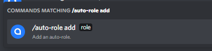

# Deleting Role Persists

Before going any further, you'll need to ensure you have the `Administrator` permission within the server you're using. If you're the Owner of the server, then you'll have no need to worry about this!

### Deleting a Role Persist with Role Manager!

The first thing you're going to have to do is ensure that Role Manager has the permissions required for its general purpose. If that's the case, then its time to get our hands dirty..

In any channel, type `/role-persist remove`, this will bring up something looking a little like the image shown below:

.png>)

This is the command we'll be using to remove a role persist from a user. To do this, simply press enter on that command. From here you'll see two required fields, one being user and the other being role.&#x20;

From here, select the user in which you'd like to remove this role persist from. Once you've done so, it should look a little something like the following:

From here, simply mention the role in which you'd like to remove and in which you'd like Role Manager to stop assigning to users upon their arrival in your server.

From here, this should then look a little something like the following:

.png>)

From here, just simply press enter and boom! Your role persist has been removed!

So there you have it! That's how you remove a role persist on Role Manager v3! Should you have any further questions or problems, don't hesistate to join our support server over @ [UtiliBots](https://discord.gg/cAtc7kZbPX)!
